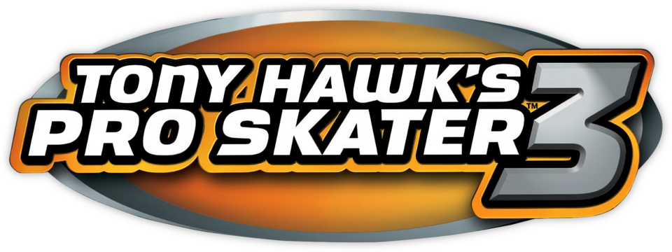

**Bem-vindos à Rom Syndicate!**

---

### 🎮 Informações do Jogo

| Sistema | Jogo | Status |
| :---: | :--- | :--- |
|  | Tony Hawk's Pro Skater 3 | Pronto |

---

Versão da Tradução: 1.0
Data de Lançamento: 08/01/2026
Autor: )

---

### Tradução

| Sistema | Autor | Status |
| :---: | :--- | :--- |
| Hacking | PuNK | 100% |
| Textos | PuNK | 100% |
| Menu | PuNK | 100% |
| Revisão | PuNK | 100% |
| Acentos | PuNK | Não |

---

### Ferramentas

| Sistema | Responsáale |
| :---: | :--- | :--- |
| HxD | PuNK |
| GBAPointer | PuNK | 

---

### Descrição

Esta tradução traz a experiência completa de Tony Hawk's Pro Skater 3
totalmente em português brasileiro. Todos os objetivos, nomes de
manobras (onde aplicável) e diálogos foram traduzidos para que você
possa aproveitar o clássico do GBA sem barreiras linguísticas.

---

### 🤝 Agradecimentos especiais !
Acreditamos que o conhecimento deve ser compartilhado. Se você utilizar nossas ferramentas ou documentação em seus projetos, pedimos apenas que:
1. À Deus por tudo.
2. À minha esposa por aguentar minha horas de tradução sem reclamar.
3. À comunidade ROMhacking.net.br por manter a cena viva.

---

**"Pela preservação e acessibilidade dos jogos clássicos."**